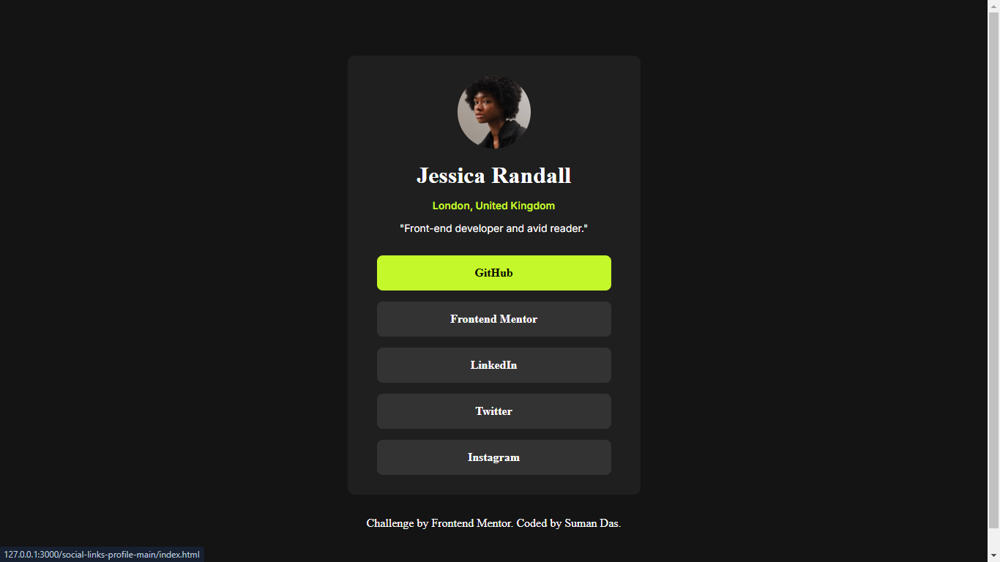

# Frontend Mentor - Social links profile solution

This is a solution to the [Social links profile challenge on Frontend Mentor](https://www.frontendmentor.io/challenges/social-links-profile-UG32l9m6dQ).

## Table of contents

- [Overview](#overview)
  - [The challenge](#the-challenge)
  - [Screenshot](#screenshot)
  - [Links](#links)
- [My process](#my-process)
  - [Built with](#built-with)
  - [What I learned](#what-i-learned)
- [Author](#author)

## Overview

### The challenge

Users should be able to:

- See hover and focus states for all interactive elements on the page

### Screenshot

### Links

- Solution URL: [https://github.com/webdevsuman/social-links-profile](https://github.com/webdevsuman/social-links-profile)
- Live Site URL: [https://webdevsuman.github.io/social-links-profile](https://webdevsuman.github.io/social-links-profile)

## My process

- Building the structure of html elements
- Giving background color of the elements
- Styling the components, using flexbox, margin, padding
- Making the page responsive with media-query and adjusting the height of the main container.

### Built with

- Semantic HTML5 markup
- CSS custom properties
- Flexbox
- Google fonts
- Favicon

### What I learned

Height and Width of the design is very crucial information.

## Author

- Website - [Suman Das](https://github.com/webdevsuman/)
- Frontend Mentor - [@webdevsuman](https://www.frontendmentor.io/profile/webdevsuman)
